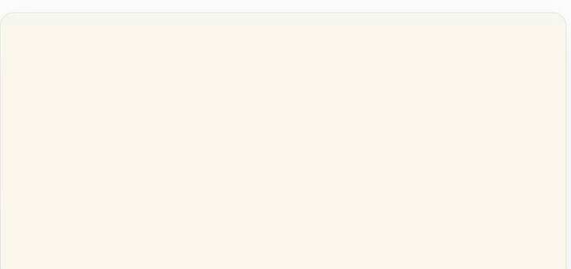
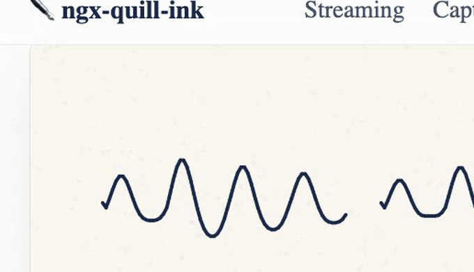

# ✒️ ngx-quill-ink

> Streaming AI shouldn't type. It should **write**.

A framework-agnostic TypeScript engine + Angular wrapper that renders streaming text as **animated handwriting** (ink flowing from an invisible quill), and captures **user pen strokes** (with a theatrical "the page drinks your ink" fade) for consumption by vision LLMs.

<p align="center">
  
</p>

Tokens arrive and the quill writes them. No typewriter effect, no spinner — the latency *is* the animation.

### …and it reads your pen, too

Draw on the surface and the page **drinks the ink**: a left-to-right dissolve absorbs your strokes and hands you a clean PNG plus the raw stroke data, ready for a vision model.

<p align="center">
  
</p>

## Packages

| Package | What | Budget |
| --- | --- | --- |
| [`@codewithahsan/quill-ink-core`](packages/quill-ink-core) | Zero-dependency canvas engine (no framework imports) | ≤ 18 KB gz |
| [`@codewithahsan/ngx-quill-ink`](packages/ngx-quill-ink) | Angular wrapper: `<quill-ink>`, signals-first, zoneless, SSR-safe | ≤ 6 KB gz |
| [`@codewithahsan/quill-ink-fonts`](packages/quill-ink-fonts) | Precomputed glyph skeleton packs for 3 OFL handwriting fonts | ~60–85 KB gz per font |

**▶ [Try the live demo](https://ahsanayaz.github.io/ngx-quill-ink/)** — streaming, capture, and a playground to tune the pen. Source in [`apps/quill-ink-demo`](apps/quill-ink-demo); it deploys to GitHub Pages on every push to `main`.

## Quick start (Angular)

```bash
npm i @codewithahsan/ngx-quill-ink @codewithahsan/quill-ink-core @codewithahsan/quill-ink-fonts
```

```ts
provideQuillInk({ font: 'caveat', packs: [caveat] })
```

```html
<quill-ink [text]="answer()" />
<quill-ink [stream]="tokenStream" />
<quill-ink [captureMode]="true" (inkCommitted)="onInk($event)" />
```

## How the magic works

Handwriting fonts are **outline** fonts; a pen needs **centerline strokes**.
Per glyph (offline, shipped as JSON packs — runtime Web Worker as fallback):

1. Rasterize at 4× → binarize at 50% luminance
2. Morphological close (protects thin fonts)
3. **Zhang-Suen thinning** to a 1px skeleton
4. 8-neighbor graph tracing — junctions follow the smallest turning angle, so
   't' and 'x' crossings stay natural pen strokes
5. Ramer-Douglas-Peucker (ε = 0.75px) + Catmull-Rom smoothing
6. Stroke ordering by min-x (a real ductus model is v2 territory)

Replay walks each stroke's arc length at pen speed with pressure noise,
ink-dot starts, tapered ends, baseline wobble, wet-ink darkening, punctuation
pauses — and a pen that *hurries* (up to 2.5×) when tokens arrive fast, or
simply rests when they don't. No spinner, ever.

## Development

```bash
npm install
npx nx run-many -t build,test,lint   # everything
npx nx serve quill-ink-demo          # demo site
npx nx run quill-ink-fonts:generate  # regenerate skeleton packs
npx nx run-many -t size              # bundle-size gates
```

## Out of scope for v1

- **RTL & CJK scripts** — the layout engine is greedy LTR word-wrap only (this is the #1 requested feature; PRs welcome, see issues)
- Ligature-aware ductus
- Stylus pressure (capture stores timestamps; `PointerEvent.pressure` in v2)
- React/Vue wrappers — the core has zero framework imports by design; issue templates are ready

## License

MIT. Font packs derived from OFL-licensed fonts (Caveat, Dancing Script,
Shadows Into Light) — each pack ships its OFL text.
